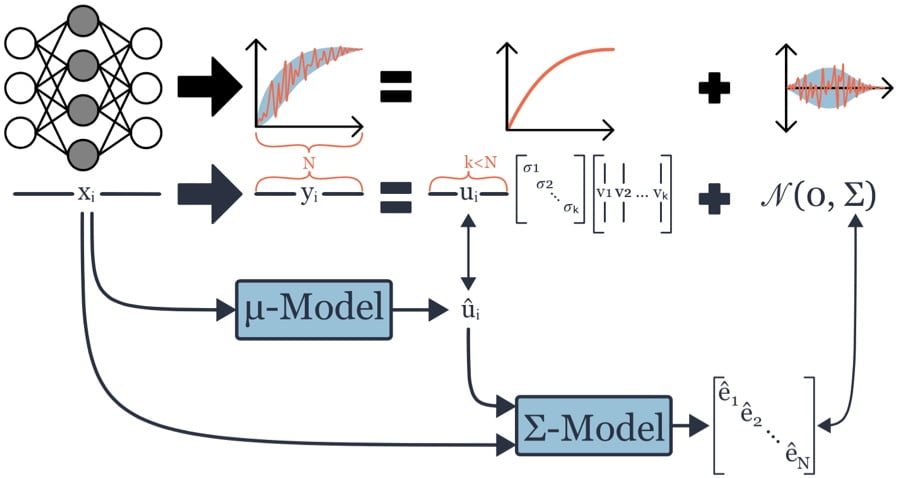

# NAS-Bench-x11

[NAS-Bench-x11 and the Power of Learning Curves](https://arxiv.org/abs/2111.03602)\
Shen Yan, Colin White, Yash Savani, Frank Hutter.\
NeurIPS 2021.

## Surrogate NAS benchmarks for multi-fidelity algorithms
We present a method to create surrogate neural architecture search (NAS) benchmarks, `NAS-Bench-111`, `NAS-Bench-311`, and `NAS-Bench-NLP11`, that output the **full training information** for each architecture, rather than just the final validation accuracy. This makes it possible to benchmark multi-fidelity techniques such as successive halving and learning curve extrapolation (LCE). Then we present a framework for converting popular single-fidelity algorithms into LCE-based algorithms.

<p align="center">

</p>

## Installation
Clone this repository and install its requirements.
```bash
git clone https://github.com/automl/nas-bench-x11
cd naszilla
cat requirements.txt | xargs -n 1 -L 1 pip install
pip install -e .
```

## Download pre-trained models
TODO: put nb311 v1.0 up on fighshare

## Using the API
TODO: simple example to show how to query the api, similar to this: https://github.com/google-research/nasbench#using-the-dataset

Now you are ready to benchmark multi-fidelity NAS algorithms on a CPU.

## Run NAS experiments from our paper
```
# Supported optimizers: (rs re ls bananas)-{svr, lce}, hb, bohb 

bash naslib/benchmarks/nas/run_nb311.sh 
bash naslib/benchmarks/nas/run_nb201.sh 
bash naslib/benchmarks/nas/run_nb201_cifar100.sh 
bash naslib/benchmarks/nas/run_nb201_imagenet16-200.sh
bash naslib/benchmarks/nas/run_nb211.sh 
bash naslib/benchmarks/nas/run_nbnlp.sh 
```
results will be saved in ``results/``.

## Train your own surrogate benchmark
TODO: maybe we put this section in its own md file? And explain the steps to take if someone has a new search space.
The previous section already lets you run NAS algorithms using the pre-trained surrogate benchmarks. Now we give instructions in case you want to train your own surrogate benchmark.

First, download the corresponding dataset.

Next, download the nas benchmark datasets (either with the terminal commands below,
or from their respective websites
([NAS-Bench-101](https://github.com/google-research/nasbench),
[NAS-Bench-301](https://github.com/automl/nasbench301), and
[NAS-Bench-NLP](https://github.com/fmsnew/nas-bench-nlp-release)).
```bash
cd data
# these files are 2GB, 300MB, and 21MB, respectively
wget https://storage.googleapis.com/nasbench/nasbench_full.tfrecord
wget https://figshare.com/ndownloader/files/25594868 -O nasbench301_models_v0.9.zip
wget https://drive.google.com/file/d/1DtrmuDODeV2w5kGcmcHcGj5JXf2qWg01
unzip nasbench301_full_data.zip
```

## Model Training
```
# Supported search spaces: nb101, darts, nlp, nb201

python fit_model.py --search_space darts --model svd_lgb
```
models will be saved in ``experiments/``.


## Citation
```bibtex
@inproceedings{yan2021bench,
  title={NAS-Bench-x11 and the Power of Learning Curves},
  author={Yan, Shen and White, Colin and Savani, Yash and Hutter, Frank},
  booktitle={Thirty-Fifth Conference on Neural Information Processing Systems},
  year={2021}
}
```
